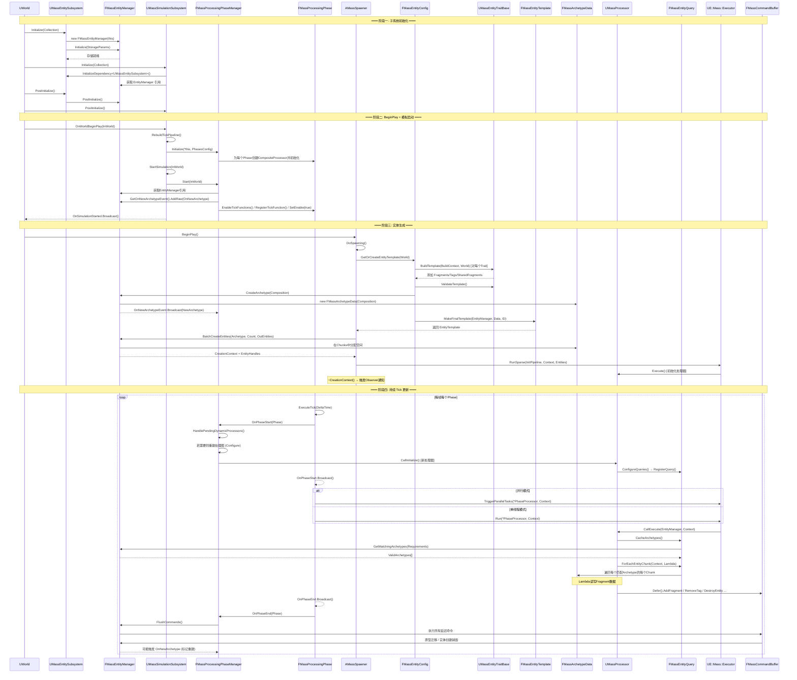

# Mass Entity 系统初始化时序图

## 概述

本文档描述了 Unreal Engine Mass Entity 框架从 BeginPlay 到所有对象加载完成，再到 Processor 持续更新的完整调用关系和初始化时序。

---

## 核心对象关系

```
┌─────────────────────────────────────────────────────────────────────────┐
│                        Mass Entity 对象关系图                            │
├─────────────────────────────────────────────────────────────────────────┤
│                                                                         │
│  UMassEntityConfigAsset (Mass实体配置资产)                               │
│       │                                                                 │
│       ├── FMassEntityConfig (配置描述)                                   │
│       │       │                                                         │
│       │       └── UMassEntityTraitBase[] (特征数组)                      │
│       │               │                                                 │
│       │               ├── 定义 Fragment 组合                             │
│       │               ├── 定义 Tag                                      │
│       │               ├── 定义 ChunkFragment                            │
│       │               └── 定义 SharedFragment                           │
│       │                                                                 │
│       └── FMassEntityTemplate (实体模板 - 由 Trait.BuildTemplate 构建)    │
│               │                                                         │
│               ├── FMassArchetypeCompositionDescriptor (原型组成描述)      │
│               │       ├── FMassFragmentBitSet (Fragment位集)             │
│               │       ├── FMassTagBitSet (Tag位集)                       │
│               │       ├── FMassChunkFragmentBitSet                       │
│               │       └── FMassSharedFragmentBitSet                      │
│               │                                                         │
│               ├── FMassArchetypeHandle → FMassArchetypeData (原型)       │
│               │       │                                                 │
│               │       └── FMassArchetypeChunk[] (数据块)                 │
│               │               │                                         │
│               │               ├── Fragment 数据 (紧密打包数组)            │
│               │               ├── ChunkFragment 数据                     │
│               │               └── SharedFragmentValues                   │
│               │                                                         │
│               └── FMassEntityHandle[] (实体句柄数组)                      │
│                       │                                                 │
│                       └── Entity → 指向 Archetype 中的索引位置            │
│                                                                         │
│  UMassProcessor (处理器)                                                 │
│       │                                                                 │
│       ├── FMassEntityQuery (实体查询)                                    │
│       │       ├── FMassFragmentRequirements (Fragment需求)               │
│       │       └── ValidArchetypes[] (匹配的原型缓存)                     │
│       │                                                                 │
│       └── Execute() → 遍历匹配原型中的所有 Chunk                         │
│                                                                         │
└─────────────────────────────────────────────────────────────────────────┘
```

---

## 阶段一：子系统初始化 (World 创建后，BeginPlay 之前)

```
┌──────────────────────────────────────────────────────────────────────────────────┐
│ 时序: 子系统 Initialize 阶段                                                      │
├──────────────────────────────────────────────────────────────────────────────────┤
│                                                                                  │
│  UWorld                                                                          │
│    │                                                                             │
│    │  ① 创建 WorldSubsystem                                                     │
│    ├──────────────────────────────────►  UMassEntitySubsystem::Initialize()      │
│    │                                         │                                   │
│    │                                         │  创建 EntityManager               │
│    │                                         ├─► FMassEntityManager(this)        │
│    │                                         │      (构造时已由构造函数创建)         │
│    │                                         │                                   │
│    │                                         │  初始化存储                         │
│    │                                         ├─► EntityManager->Initialize()     │
│    │                                         │      │                            │
│    │                                         │      ├─ 初始化实体存储              │
│    │                                         │      └─ 设置页表/并发储备           │
│    │                                         │                                   │
│    │                                         └─► HandleLateCreation()            │
│    │                                                                             │
│    │  ② 创建 SimulationSubsystem (依赖 EntitySubsystem)                          │
│    ├──────────────────────────────────►  UMassSimulationSubsystem::Initialize()  │
│    │                                         │                                   │
│    │                                         │  获取 EntityManager 引用           │
│    │                                         ├─► Collection.InitializeDependency │
│    │                                         │      <UMassEntitySubsystem>()     │
│    │                                         │                                   │
│    │                                         ├─► EntityManager = EntitySubsystem │
│    │                                         │      ->GetMutableEntityManager()  │
│    │                                         │      .AsShared()                  │
│    │                                         │                                   │
│    │                                         └─► 注册 PrePhysics Phase 回调       │
│    │                                                                             │
│    │  ③ 创建 SpawnerSubsystem                                                    │
│    ├──────────────────────────────────►  UMassSpawnerSubsystem::Initialize()     │
│    │                                         │                                   │
│    │                                         ├─► 获取 EntityManager 引用          │
│    │                                         └─► 初始化 TemplateRegistry         │
│    │                                                                             │
│    │  ④ PostInitialize 阶段                                                      │
│    ├──────────────────────────────────►  UMassEntitySubsystem::PostInitialize()  │
│    │                                         │                                   │
│    │                                         └─► EntityManager->PostInitialize() │
│    │                                               │                             │
│    │                                               └─ (供 Processor 访问已初始化  │
│    │                                                    的子系统)                  │
│    │                                                                             │
│    ├──────────────────────────────────►  UMassSimulationSubsystem::              │
│    │                                      PostInitialize()                       │
│    │                                         │                                   │
│    │                                         └─ (编辑器模式: RebuildTickPipeline  │
│    │                                              + StartSimulation)             │
│    │                                                                             │
└──────────────────────────────────────────────────────────────────────────────────┘
```

---

## 阶段二：World BeginPlay → 模拟启动

```
┌──────────────────────────────────────────────────────────────────────────────────────┐
│ 时序: OnWorldBeginPlay → 启动模拟                                                     │
├──────────────────────────────────────────────────────────────────────────────────────┤
│                                                                                      │
│  UWorld::BeginPlay()                                                                 │
│    │                                                                                 │
│    │  ⑤ 通知 SimulationSubsystem                                                    │
│    ├──────────────────────────────────► UMassSimulationSubsystem::                   │
│    │                                     OnWorldBeginPlay(InWorld)                    │
│    │                                         │                                       │
│    │                                         │  ⑥ 重建 Tick 管线                      │
│    │                                         ├─► RebuildTickPipeline()                │
│    │                                         │       │                                │
│    │                                         │       │  读取 MassEntitySettings 配置   │
│    │                                         │       ├─► GET_MASS_CONFIG_VALUE(       │
│    │                                         │       │     GetProcessingPhasesConfig) │
│    │                                         │       │                                │
│    │                                         │       │  ⑦ 初始化 PhaseManager         │
│    │                                         │       └─► PhaseManager->Initialize(    │
│    │                                         │              *this, PhasesConfig)      │
│    │                                         │               │                        │
│    │                                         │               │  为每个 Phase 创建       │
│    │                                         │               │  CompositeProcessor     │
│    │                                         │               ├─► for each Phase:      │
│    │                                         │               │     NewObject<          │
│    │                                         │               │      UMassComposite     │
│    │                                         │               │      Processor>()       │
│    │                                         │               │                        │
│    │                                         │               │  初始化 ProcessingPhase  │
│    │                                         │               │  (关联 TickGroup)        │
│    │                                         │               └─► Phase.Initialize(    │
│    │                                         │                     PhaseManager,       │
│    │                                         │                     TickGroup,          │
│    │                                         │                     PhaseProcessor)     │
│    │                                         │                                        │
│    │                                         │  ⑧ 启动模拟                             │
│    │                                         └─► StartSimulation(InWorld)             │
│    │                                                 │                                │
│    │                                                 │  ⑨ 启动 PhaseManager           │
│    │                                                 ├─► PhaseManager->Start(InWorld) │
│    │                                                 │       │                        │
│    │                                                 │       │  获取 EntityManager     │
│    │                                                 │       ├─► EntityManager =      │
│    │                                                 │       │    EntitySubsystem->    │
│    │                                                 │       │    GetEntityManager()   │
│    │                                                 │       │                        │
│    │                                                 │       │  监听新原型事件          │
│    │                                                 │       ├─► EntityManager->       │
│    │                                                 │       │    GetOnNewArchetype    │
│    │                                                 │       │    Event().AddRaw(      │
│    │                                                 │       │    OnNewArchetype)      │
│    │                                                 │       │                        │
│    │                                                 │       │  ⑩ 启用 Tick 函数       │
│    │                                                 │       └─► EnableTickFunctions() │
│    │                                                 │              │                  │
│    │                                                 │              │ 为每个Phase注册    │
│    │                                                 │              │ TickFunction      │
│    │                                                 │              └─► for each Phase:│
│    │                                                 │                   RegisterTick  │
│    │                                                 │                   Function()    │
│    │                                                 │                   SetTickEnable │
│    │                                                 │                   (true)        │
│    │                                                 │                                │
│    │                                                 │  广播模拟已启动                  │
│    │                                                 └─► OnSimulationStarted.         │
│    │                                                       Broadcast(&InWorld)        │
│    │                                                                                  │
└──────────────────────────────────────────────────────────────────────────────────────┘
```

---

## 阶段三：实体生成 (Spawning)

```
┌──────────────────────────────────────────────────────────────────────────────────────┐
│ 时序: Actor BeginPlay → 实体生成                                                      │
├──────────────────────────────────────────────────────────────────────────────────────┤
│                                                                                      │
│  AMassSpawner::BeginPlay()                                                           │
│    │                                                                                 │
│    │  检查 bAutoSpawnOnBeginPlay && SimulationStarted                                │
│    │  (若 Simulation 未启动则监听 OnSimulationStarted 延后生成)                        │
│    │                                                                                 │
│    │  ⑪ 执行生成                                                                     │
│    ├──────────────────────────────────► DoSpawning()                                 │
│    │                                     │                                           │
│    │                                     │  加载资产 (异步)                            │
│    │                                     ├─► StreamableManager.RequestAsyncLoad()    │
│    │                                     │                                           │
│    │                                     │  生成点数据生成                             │
│    │                                     ├─► SpawnDataGenerator->Generate()           │
│    │                                     │                                           │
│    │                                     │  ⑫ 生成实体                                │
│    │                                     └─► SpawnGeneratedEntities(Results)          │
│    │                                           │                                     │
│    │                                           │  获取/创建实体模板                    │
│    │                                           ├─► EntityConfig->                     │
│    │                                           │     GetOrCreateEntityTemplate(World) │
│    │                                           │       │                              │
│    │                                           │       │  ⑬ 构建模板                  │
│    │                                           │       ├─► 遍历所有 Traits:            │
│    │                                           │       │     Trait->BuildTemplate(    │
│    │                                           │       │       BuildContext, World)   │
│    │                                           │       │       │                      │
│    │                                           │       │       ├─ AddFragment<T>()    │
│    │                                           │       │       ├─ AddTag<T>()         │
│    │                                           │       │       ├─ AddChunkFragment<T>│
│    │                                           │       │       └─ AddSharedFragment() │
│    │                                           │       │                              │
│    │                                           │       │  ⑭ 验证模板                  │
│    │                                           │       ├─► Trait->ValidateTemplate()  │
│    │                                           │       │                              │
│    │                                           │       │  ⑮ 最终化模板 → 创建原型      │
│    │                                           │       └─► FMassEntityTemplate::      │
│    │                                           │             MakeFinalTemplate()      │
│    │                                           │               │                     │
│    │                                           │               └─► EntityManager->    │
│    │                                           │                     CreateArchetype( │
│    │                                           │                      Composition)    │
│    │                                           │                       │              │
│    │                                           │                       │ 创建          │
│    │                                           │                       │ Archetype    │
│    │                                           │                       │ Data         │
│    │                                           │                       ├─► new        │
│    │                                           │                       │  FMassArche  │
│    │                                           │                       │  typeData()  │
│    │                                           │                       │              │
│    │                                           │                       │ 广播新原型    │
│    │                                           │                       └─► OnNew      │
│    │                                           │                          Archetype   │
│    │                                           │                          Event.      │
│    │                                           │                          Broadcast() │
│    │                                           │                                     │
│    │                                           │  ⑯ 批量创建实体                      │
│    │                                           ├─► SpawnerSubsystem->SpawnEntities(  │
│    │                                           │     Template, Count, OutEntities)    │
│    │                                           │       │                              │
│    │                                           │       │  批量创建                     │
│    │                                           │       ├─► EntityManager->            │
│    │                                           │       │     BatchCreateEntities(     │
│    │                                           │       │       Archetype, Count)      │
│    │                                           │       │       │                      │
│    │                                           │       │       │ 分配实体句柄           │
│    │                                           │       │       ├─► 在 Archetype 的     │
│    │                                           │       │       │   Chunk 中分配空间    │
│    │                                           │       │       │                      │
│    │                                           │       │       │ 返回 CreationContext  │
│    │                                           │       │       └─► (持有观察者锁)      │
│    │                                           │       │                              │
│    │                                           │       │  设置初始 Fragment 值          │
│    │                                           │       ├─► 初始化 Fragment 数据         │
│    │                                           │       │     (从 Template 的           │
│    │                                           │       │      InitialFragmentValues)  │
│    │                                           │       │                              │
│    │                                           │       │  运行初始化 Pipeline          │
│    │                                           │       ├─► UE::Mass::Executor::       │
│    │                                           │       │     RunSparse(Pipeline,      │
│    │                                           │       │       Context, Entities)     │
│    │                                           │       │                              │
│    │                                           │       │  释放 CreationContext         │
│    │                                           │       └─► ~FEntityCreationContext()  │
│    │                                           │             │                        │
│    │                                           │             └─► 触发 Observer 通知    │
│    │                                           │                  (Add Fragment 观察者)│
│    │                                           │                                     │
│    │                                           └─► OnSpawningFinishedEvent.          │
│    │                                                 Broadcast()                     │
│    │                                                                                 │
└──────────────────────────────────────────────────────────────────────────────────────┘
```

---

## 阶段四：Processor 持续更新 (每帧 Tick)

```
┌──────────────────────────────────────────────────────────────────────────────────────┐
│ 时序: 每帧 Tick → Processor 执行                                                      │
├──────────────────────────────────────────────────────────────────────────────────────┤
│                                                                                      │
│  引擎 Tick (每帧)                                                                    │
│    │                                                                                 │
│    │  按 TickGroup 触发各 Phase 的 TickFunction                                       │
│    │                                                                                 │
│    │  ┌─── PrePhysics ──── StartPhysics ──── DuringPhysics ───┐                      │
│    │  │    EndPhysics ──── PostPhysics ────── FrameEnd         │                      │
│    │  └───────────────────────────────────────────────────────┘                      │
│    │                                                                                 │
│    │  对于每个 Phase (以 PrePhysics 为例):                                             │
│    │                                                                                 │
│    ├──────────────────────────────────► FMassProcessingPhase::ExecuteTick()           │
│    │                                     │                                           │
│    │                                     │  ⑰ Phase 开始                              │
│    │                                     ├─► PhaseManager->OnPhaseStart(*this)       │
│    │                                     │       │                                   │
│    │                                     │       │  处理待定动态处理器                  │
│    │                                     │       ├─► HandlePendingDynamicProcessor   │
│    │                                     │       │     Operations()                  │
│    │                                     │       │                                   │
│    │                                     │       │  ⑱ 检查是否需要重建处理图           │
│    │                                     │       │  (当有新 Archetype 或处理器变动时)   │
│    │                                     │       └─► if (bNewArchetypes ||           │
│    │                                     │             bProcessorsNeedRebuild)       │
│    │                                     │             │                             │
│    │                                     │             │  重建处理依赖图              │
│    │                                     │             ├─► FMassPhaseProcessor       │
│    │                                     │             │    ConfigurationHelper::     │
│    │                                     │             │    Configure()              │
│    │                                     │             │       │                     │
│    │                                     │             │       │ 收集CDO处理器        │
│    │                                     │             │       ├─► AppendUnique      │
│    │                                     │             │       │   RuntimeProcessor   │
│    │                                     │             │       │   Copies(CDOs)       │
│    │                                     │             │       │                     │
│    │                                     │             │       │ 追加动态处理器        │
│    │                                     │             │       ├─► for DynamicProc:  │
│    │                                     │             │       │   AppendUnique()    │
│    │                                     │             │       │                     │
│    │                                     │             │       │ 解析依赖             │
│    │                                     │             │       ├─► DependencySolver  │
│    │                                     │             │       │   .ResolveDeps()    │
│    │                                     │             │       │                     │
│    │                                     │             │       │ 更新处理器集合        │
│    │                                     │             │       ├─► UpdateProcessors  │
│    │                                     │             │       │   Collection()      │
│    │                                     │             │       │                     │
│    │                                     │             │       │ 构建并行图            │
│    │                                     │             │       ├─► BuildFlat         │
│    │                                     │             │       │   ProcessingGraph() │
│    │                                     │             │       │                     │
│    │                                     │             │       │ 初始化新创建处理器    │
│    │                                     │             │       └─► InitializeInternal│
│    │                                     │             │            │                │
│    │                                     │             │            │ 对每个处理器:   │
│    │                                     │             │            ├─► Configure    │
│    │                                     │             │            │   Queries()    │
│    │                                     │             │            │   │            │
│    │                                     │             │            │   └─ 注册      │
│    │                                     │             │            │     Fragment   │
│    │                                     │             │            │     需求        │
│    │                                     │             │            │                │
│    │                                     │             │            └─► Processor->  │
│    │                                     │             │                CallInit()   │
│    │                                     │             │                             │
│    │                                     │             └─► bInitialized = true       │
│    │                                     │                                           │
│    │                                     │  广播 OnPhaseStart                         │
│    │                                     ├─► OnPhaseStart.Broadcast(DeltaTime)       │
│    │                                     │                                           │
│    │                                     │  ⑲ 执行处理器 (并行或单线程)               │
│    │                                     ├─► if (bRunInParallelMode)                 │
│    │                                     │       │                                   │
│    │                                     │       │  并行模式                          │
│    │                                     │       └─► UE::Mass::Executor::            │
│    │                                     │             TriggerParallelTasks(          │
│    │                                     │               *PhaseProcessor, Context)   │
│    │                                     │               │                           │
│    │                                     │               │  ⑳ 对每个 Processor:       │
│    │                                     │               ├─► Processor->CallExecute()│
│    │                                     │               │       │                   │
│    │                                     │               │       │  缓存原型匹配      │
│    │                                     │               │       ├─► Query.          │
│    │                                     │               │       │   CacheArchetypes()│
│    │                                     │               │       │   │               │
│    │                                     │               │       │   └─ 从 Entity    │
│    │                                     │               │       │     Manager 获取  │
│    │                                     │               │       │     匹配的原型    │
│    │                                     │               │       │                   │
│    │                                     │               │       │  遍历 Chunk 执行   │
│    │                                     │               │       ├─► Query.ForEach   │
│    │                                     │               │       │   EntityChunk(    │
│    │                                     │               │       │     Context,      │
│    │                                     │               │       │     Lambda)       │
│    │                                     │               │       │     │             │
│    │                                     │               │       │     │ 对每个匹配  │
│    │                                     │               │       │     │ Archetype:  │
│    │                                     │               │       │     ├─ 绑定       │
│    │                                     │               │       │     │  Fragment   │
│    │                                     │               │       │     │  视图        │
│    │                                     │               │       │     │             │
│    │                                     │               │       │     │ 对每个Chunk │
│    │                                     │               │       │     ├─ 执行       │
│    │                                     │               │       │     │  Lambda     │
│    │                                     │               │       │     │  (读写      │
│    │                                     │               │       │     │  Fragment   │
│    │                                     │               │       │     │  数据)       │
│    │                                     │               │       │     │             │
│    │                                     │               │       │     └─ 命令延迟    │
│    │                                     │               │       │       缓冲写入    │
│    │                                     │               │       │                   │
│    │                                     │               │       └─► (修改实体组成    │
│    │                                     │               │            通过            │
│    │                                     │               │            CommandBuffer)  │
│    │                                     │               │                           │
│    │                                     │               └─► OnParallelExecutionDone │
│    │                                     │                                           │
│    │                                     │  else 单线程模式                           │
│    │                                     ├─► UE::Mass::Executor::Run(               │
│    │                                     │     *PhaseProcessor, Context)             │
│    │                                     │                                           │
│    │                                     │  广播 OnPhaseEnd                           │
│    │                                     ├─► OnPhaseEnd.Broadcast(DeltaTime)         │
│    │                                     │                                           │
│    │                                     │  ㉑ Phase 结束                             │
│    │                                     └─► PhaseManager->OnPhaseEnd(*this)         │
│    │                                           │                                     │
│    │                                           │  刷新命令缓冲                        │
│    │                                           └─► EntityManager->FlushCommands()    │
│    │                                                 │                               │
│    │                                                 │ 执行延迟的实体操作:             │
│    │                                                 ├─ 添加/移除 Fragment            │
│    │                                                 ├─ 添加/移除 Tag                 │
│    │                                                 ├─ 创建/销毁实体                  │
│    │                                                 ├─ 原型迁移 (组成变化)            │
│    │                                                 └─ 触发 Observer 通知             │
│    │                                                                                 │
│    │  继续下一个 Phase...                                                             │
│    │                                                                                 │
└──────────────────────────────────────────────────────────────────────────────────────┘
```

---

## 阶段五：原型迁移 (运行时组成变化)

```
┌──────────────────────────────────────────────────────────────────────────────────────┐
│ 时序: 实体组成变化 → 原型迁移                                                         │
├──────────────────────────────────────────────────────────────────────────────────────┤
│                                                                                      │
│  Processor 中通过 CommandBuffer 请求变更:                                             │
│    │                                                                                 │
│    │  Context.Defer().AddFragment<FNewFragment>(Entity)                               │
│    │    或                                                                            │
│    │  Context.Defer().RemoveTag<FOldTag>(Entity)                                     │
│    │                                                                                 │
│    │  ═══════════ Phase结束时 FlushCommands ═══════════                               │
│    │                                                                                 │
│    ├──────────────────────────────────► EntityManager->AddFragmentToEntity()          │
│    │                                     │                                           │
│    │                                     │  当前原型 + 新Fragment = 新组成             │
│    │                                     ├─► CreateArchetype(SourceArchetype,         │
│    │                                     │     NewFragments)                          │
│    │                                     │     │                                     │
│    │                                     │     │ 查找或创建匹配的原型                  │
│    │                                     │     └─► (可能触发 OnNewArchetypeEvent)     │
│    │                                     │                                           │
│    │                                     │  将实体数据从旧原型搬迁到新原型              │
│    │                                     ├─► MoveEntityToArchetype(Entity,            │
│    │                                     │     NewArchetype)                          │
│    │                                     │     │                                     │
│    │                                     │     ├─ 从旧 Chunk 拷贝公共 Fragment 数据    │
│    │                                     │     ├─ 新 Fragment 初始化为默认值           │
│    │                                     │     └─ 更新 Entity 的 Archetype 引用       │
│    │                                     │                                           │
│    │                                     │  通知 Observer                             │
│    │                                     └─► ObserverManager.OnCompositionChanged()  │
│    │                                                                                 │
│    │  ═══════ 下一帧 OnPhaseStart 检测到新 Archetype ═══════                         │
│    │                                                                                 │
│    ├──────────────────────────────────► OnNewArchetype 回调                           │
│    │                                     │                                           │
│    │                                     └─► 标记所有 Phase 需要重建处理图             │
│    │                                           GraphBuildState.bNewArchetypes = true  │
│    │                                                                                 │
│    │  下一帧 Phase 开始时重新配置处理器                                                │
│    │  (新原型会被纳入到匹配 Query 的处理器中)                                          │
│    │                                                                                 │
└──────────────────────────────────────────────────────────────────────────────────────┘
```

---

## 完整时序总结 (Mermaid 格式)



---

## 关键设计要点

| 概念 | 说明 |
|------|------|
| **Entity (实体)** | 轻量级句柄 (`FMassEntityHandle`)，由 Index + SerialNumber 组成，指向 Archetype 中的具体位置 |
| **Fragment (片段)** | 存储在 Archetype Chunk 中的 SOA 数据，继承自 `FMassFragment` |
| **Archetype (原型)** | 拥有相同 Fragment+Tag 组成的实体集合，数据存储在 `FMassArchetypeChunk` 紧密数组中 |
| **Trait (特征)** | 设计时概念，通过 `BuildTemplate()` 向实体模板添加 Fragment/Tag 组合 |
| **Tag (标签)** | 无数据的原型级标记，继承自 `FMassTag`，用于 Query 过滤 |
| **Chunk Fragment (区块片段)** | 每个 Chunk 一份数据而非每个 Entity 一份，继承自 `FMassChunkFragment` |
| **Shared Fragment (共享片段)** | 多个实体共享同一份数据的 Fragment，继承自 `FMassSharedFragment` |
| **Processor (处理器)** | 逻辑执行单元，拥有 `FMassEntityQuery` 来匹配原型，在 `Execute()` 中处理数据 |
| **Entity Query (实体查询)** | 通过 Fragment 需求匹配 Archetype，返回 Chunk 批次供遍历 |
| **Processing Phase (处理阶段)** | 6个阶段对应引擎 TickGroup: PrePhysics → FrameEnd，每帧顺序执行 |
| **Command Buffer (命令缓冲)** | 延迟执行的实体操作，Phase 结束时统一 Flush，避免迭代中修改数据 |
| **Archetype Migration (原型迁移)** | 实体组成变化时从旧原型搬迁到新原型，下帧处理图可能重建 |

---

## 处理阶段 (Processing Phases) 与引擎 Tick Group 映射

| Phase | TickGroup | 典型用途 |
|-------|-----------|----------|
| `PrePhysics` | TG_PrePhysics | 移动、导航、LOD 计算、实体压缩 |
| `StartPhysics` | TG_StartPhysics | 物理模拟开始前的准备 |
| `DuringPhysics` | TG_DuringPhysics | 与物理并行的计算 |
| `EndPhysics` | TG_EndPhysics | 物理结果收集 |
| `PostPhysics` | TG_PostPhysics | 表现更新、同步 |
| `FrameEnd` | TG_LastDemotable | 清理、统计、可视化 |
